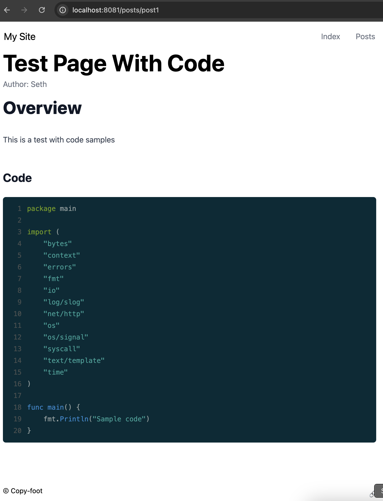

# static-site-example
Example static-site that can render markdown posts.

## Requirements
### Go
Install [Go](https://go.dev/doc/install). This was built and tested with v1.23, however, it should work for older versions as well.

### Tailwind
This requires the [Tailwind cli](https://tailwindcss.com/docs/installation). 

## Run
To run, simply execute the make target `run-local`, which will compile the tailwind css and start the web server on `:8081`.
